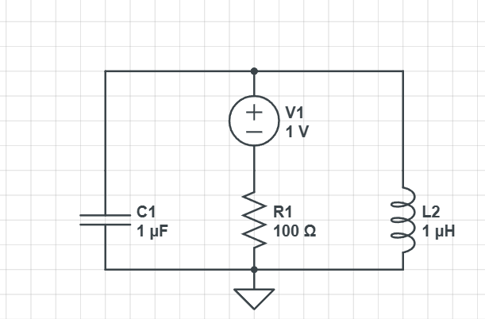
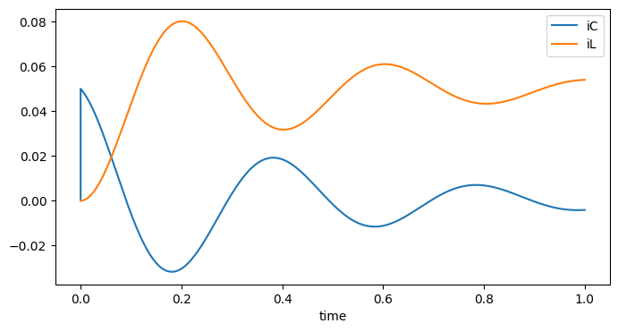
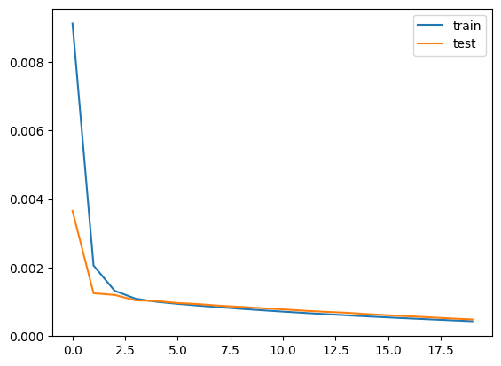
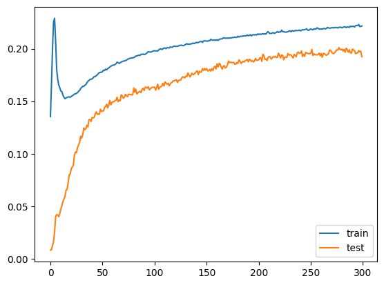
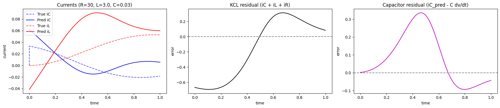
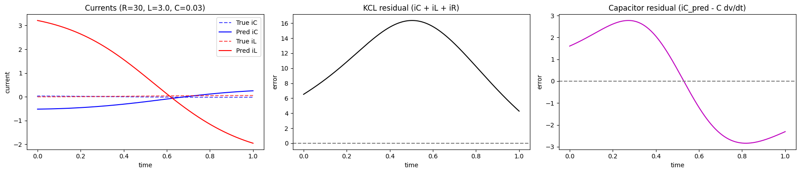

# Physics-Informed Neural Networks for Circuit Dynamics: A Comparative Analysis

A PyTorch project comparing a physics-informed neural network (PINN) against a standard multilayer perceptron (MLP) for learning parallel RLC circuit dynamics from synthetic data.

This project studies a simple but important question: does adding circuit physics directly into the loss function improve prediction quality and physical consistency over a purely data-driven baseline?

## Project Overview

The repository contains a controlled comparison between two models trained on the same synthetic parallel RLC dataset:

- **Baseline MLP** trained only with mean squared error
- **PINN** trained with data loss plus physics-based residual penalties

Both models use the same neural-network architecture, so the comparison focuses on the impact of physics regularization rather than differences in model capacity.

The final notebook uses:

- **Inputs:** `time, R, L, C, vs`
- **Outputs:** `IC, IL`
- **Framework:** PyTorch
- **Derivative computation:** `torch.autograd.grad`

## Motivation

Physics-Informed Neural Networks are often presented as a superior alternative to purely data-driven models. In practice, that depends heavily on the regime.

This project explores that question in a dense, noise-free synthetic setting generated from RLC circuit responses. Instead of assuming the PINN will perform better, the work evaluates both:

1. Prediction accuracy
2. Physical constraint satisfaction

The result is intentionally honest: in this setup, the plain baseline performed better.

## Circuit Physics Used

The PINN is regularized using circuit relationships from a parallel RLC formulation.

The physics loss enforces:

- **Kirchhoff’s Current Law (KCL):**  
  \( i_C + i_L + i_R = 0 \)

- **Capacitor relation:**  
  \( i_C = C \frac{dv}{dt} \)

The notebook computes derivatives through the network using autograd. From the predicted inductor current, it reconstructs voltage using the inductor relation and then differentiates again to form the capacitor residual.

This makes the project more than a standard supervised-learning notebook: the circuit equations are translated directly into the training objective.

## Methodology

### 1. Dataset generation

A dense synthetic dataset of parallel RLC responses was generated across varying circuit parameters and source voltages. The uploaded data is included in the repository so the full experiment is reproducible.

### 2. Baseline model

A standard MLP was trained using only supervised mean squared error between predicted and true currents.

### 3. PINN model

A second model with the same architecture was trained using:

- data loss
- KCL residual loss
- capacitor residual loss

The physics weight was ramped gradually from a small value to a larger value during training instead of being applied at full strength from the start.

### 4. Residual evaluation

To evaluate whether the PINN actually respected the governing equations, the project reconstructs specific trajectories and measures:

- mean absolute KCL residual
- mean absolute capacitor residual

This is important because a PINN should be judged on both fit quality and physics compliance.

## Model Architecture

Both the baseline and PINN use the same feedforward network:

- Linear(5 → 64)
- Tanh
- Linear(64 → 32)
- Tanh
- Linear(32 → 15)
- Tanh
- Linear(15 → 2)

This keeps the comparison fair: the main difference is the loss formulation, not the representational power of the model.

## Final Result

In the final notebook run:

- **Baseline test MSE:** `0.00015775408489086354`
- **PINN test MSE:** `0.22964280067632595`

The key result is a **negative result**:

- In this dense and noise-free regime, the baseline MLP achieved much better predictive accuracy.
- The PINN introduced optimization difficulty and degraded the final fit.
- This suggests that explicit physics regularization is not automatically beneficial when the training data is already abundant and clean.

That does **not** mean PINNs are useless. It means their value is regime-dependent. They are more compelling when data is sparse, noisy, partially observed, or when extrapolation matters more than interpolation.

## Engineering Takeaway

This project matters because it demonstrates:

- custom PyTorch training loops
- autograd-based derivative computation inside the loss
- translation of electrical-engineering equations into machine-learning objectives
- fair baseline comparison
- residual-based scientific evaluation
- willingness to document a negative result instead of forcing a hype-driven conclusion

In other words, the project is not just about building a neural network. It is about testing whether a modeling idea actually helps.

## Repository Structure

```text
.
├── data/
├── images/
├── PINN
├── README
├── requirements
└── .gitignore
```

## Visuals

### Circuit and sample data




### Training behavior




### Residual analysis




## How to Run

1. Clone the repository.
2. Install dependencies:
   ```bash
   pip install -r requirements.txt
   ```
3. Launch Jupyter Notebook:
   ```bash
   jupyter notebook
   ```
4. Open the project notebook and run the cells in order.

## Possible Next Extensions

Some natural follow-up directions for this project are:

- testing the same setup under noisy data
- reducing training-data density to study low-data behavior
- evaluating extrapolation to unseen circuit parameters
- tuning the physics-loss schedule
- predicting additional states such as node voltage or resistor current
- comparing against better-scaled or adaptive PINN formulations

## Summary

This repository presents a comparative study of a standard MLP and a physics-informed neural network on parallel RLC circuit dynamics.

The most important result is that the simpler baseline won in the final experiment. That negative result is the value of the project: it shows practical engineering judgment, not just implementation.
